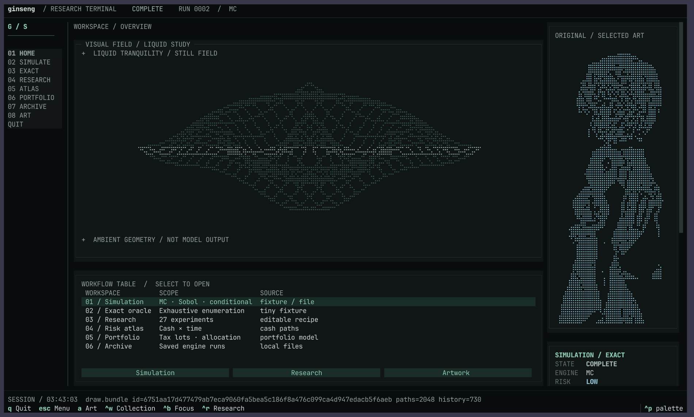

# Ginseng TUI

A terminal workspace for cash-flow simulation and quantitative research. Near-black surfaces, silver text, mint accents, a liquid wireframe study, and the original Braille portrait.



This standalone edition contains the TUI and the local Python engine that powers its workflows. It runs without an account or server. Extracted from [Ginseng](https://github.com/nunera/ginseng), with Zachary Stubbs' current interface customizations.

## Run

Requires **Python 3.12** and [uv](https://docs.astral.sh/uv/).

```sh
git clone https://github.com/ZacharySF/ginseng-tui.git
cd ginseng-tui
uv sync --locked
uv run ginseng-tui
```

For optimization and report plots:

```sh
uv sync --locked --extra optimization --extra research
uv run ginseng-tui
```

`uv run ginseng tui` also launches the workspace. Use a terminal font with Braille glyphs; no Nerd Font or image protocol is needed. Set `GINSENG_MOTION=0` to disable animation.

## Inside the workspace

- **Simulation:** Monte Carlo, scrambled Sobol, conditional estimation, synthetic fixtures, and local JSON inputs.
- **Exact:** enumerate the tiny reference case and inspect its cash paths.
- **Research:** editable recipes, precision stopping, sampler comparisons, funding analysis, personal forecasts, and capture/replay.
- **Risk atlas:** cash/time shortfall heatmaps and selectable numeric scatter plots.
- **Portfolio:** tax-lot liquidation and allocation analysis, with optional CVXPY optimization.
- **Archive and notebook:** reopen saved runs, compare results, and export JSON or CSV.
- **Artwork:** the original cyberpunk portrait, with scrollable glyph-preserving views.

| Key | Action |
| --- | --- |
| `Ctrl+P` | Search commands and workflows |
| `Ctrl+R` | Open research |
| `Ctrl+W` | Open artwork |
| `Ctrl+B` | Toggle navigation and inspector |
| `Esc` | Return home |
| `q` | Quit |

Results and explicit exports are written under `artifacts/tui/`. Included examples are synthetic. Simulations describe the chosen model; more paths improve numerical precision, not the amount of historical evidence.

See the [workspace guide](docs/tui-studio.md) for recipes, exports, and optional connections.

## Scope

The website, HTTP server, database deployment, and native C++ build are maintained in the full Ginseng repository. Connected-service recipes remain available as an optional client for an existing Ginseng server; nothing connects at startup. The native performance suite requires the full repository and reports that requirement when selected. Local simulation, exact enumeration, capture, replay, and diff use NumPy by default.

The `ginseng` Python package and helper CLI are included because research recipes use them. Install this distribution in its own environment if you also develop the full application.

## Development

```sh
uv sync --locked --extra optimization --extra research
uv run --no-sync pytest -q
uv build
```

Tests cover numerical behavior, terminal interactions, research subprocesses, compact layouts, and visual snapshots. HTTP server contract tests stay with the full application.

Source provenance and contributor credit are recorded in [NOTICE.md](NOTICE.md).
